# Design Document

## Overview

This document describes the design of the **StreetJS + MarzPay Demo** (`Demo_App`): a minimal, end-to-end application that proves the StreetJS web framework integrates correctly with the `@streetjs/plugin-marzpay` plugin against the **real MarzPay sandbox**. The demo implements exactly one business flow — a Ugandan mobile-money (UGX) collection — and nothing more:

```
Customer enters phone + clicks "Pay 5000 UGX" → StreetJS controller
  → marzpay.collections.collectMoney({ amount: 5000, country: 'UG', reference, phone_number })
  → pending Payment_Record stored (built-in SQLite)
  → customer approves the prompt on their phone
  → MarzPay webhook → validateWebhook (best-effort) → authoritative getStatus(reference)
  → on completed status, read transactions.get(reference) → completed Payment_Record stored
  → Success page renders the stored record (status-driven)
```

The design is deliberately small. It uses real network calls against `MarzPay_Sandbox` (no mocks, no fake payment responses) for the live integration paths, while isolating the pure, deterministic logic (configuration validation, reference generation, phone validation gating, webhook payload parsing, status-completion interpretation, persistence idempotency, display formatting) so it can be exercised with fast, deterministic tests including property-based tests.

### Design Goals

- **Single flow, end-to-end, real sandbox.** The happy path must traverse a genuine MarzPay sandbox mobile-money collection.
- **Fail fast and loud on misconfiguration.** Missing or invalid environment configuration terminates startup before any port is bound, naming every offending variable.
- **Authoritative confirmation before effect.** No payment is marked completed on the strength of a webhook alone; completion is confirmed by `collections.getStatus(reference)` because the webhook signature scheme is a documented plugin limitation.
- **Idempotent persistence.** Re-delivered webhooks (a normal occurrence) never create duplicate records.
- **5-minute onboarding.** A `README.md` walks a new developer from clone to running server.

### Technology Choices

| Concern | Choice | Rationale |
| --- | --- | --- |
| Language | TypeScript (Node.js >= 20) | Type safety across controllers, helpers, and DB layer; required by StreetJS. |
| Module system | ESM (`"type": "module"`), `NodeNext` | Mandated by StreetJS (ESM-only). |
| Web framework | StreetJS | Mandated by the spec; decorator routing, DI, plugin host, and built-in SQLite. |
| Payment integration | `@streetjs/plugin-marzpay` | Mandated by the spec; injects the MarzPay client at `ctx.state.marzpay`. |
| Persistence | StreetJS built-in SQLite | Zero external dependency; the framework ships SQLite, used for the `payments` table. |
| Env loading | `dotenv` | Loads `.env` for local development. |
| Test runner | `vitest` | Fast TS-native runner. |
| Property testing | `fast-check` | Mature PBT library for the JS/TS ecosystem. |

> **Integration boundary.** StreetJS and the MarzPay plugin are treated as given dependencies whose public surface is fixed by their published APIs. The plugin is installed with `MarzPayPlugin({ apiKey, secretKey, environment, stateKey, timeoutMs })` and injects the MarzPay client at `ctx.state.marzpay`. **The plugin client IS the integration boundary** — controllers call it directly via `ctx.state.marzpay`. A thin helper module holds only the pure, framework-independent logic: reference generation, phone-validation delegation, status-completion interpretation, and webhook payload parsing. There is no separate hand-rolled HTTP wrapper.

> **Verified-capability note.** The MarzPay webhook **signature scheme** is recorded by the plugin author as an undocumented limitation. Accordingly, `validateWebhook(rawBody, signature)` is treated as a best-effort gate, and payment completion is authoritatively confirmed by calling `collections.getStatus(reference)` (and reading amount/currency via `transactions.get(reference)`) before a payment is marked completed. The webhook event name is also undocumented, so completion is determined from the returned **status value** rather than any assumed event name. The plugin operations `disbursements.sendMoney`, `accounts.getBalance`, `phoneVerification.*`, and `refund` are unsupported (they throw and issue no network request); no feature in this demo depends on them.

## Architecture

The application is a single StreetJS server process. Requests are routed by StreetJS decorators into four controllers. Two of them (`CheckoutController`, `WebhookController`) collaborate with the MarzPay client (`ctx.state.marzpay`, real sandbox) and the `Payment_Store` (built-in SQLite). Startup is gated by configuration validation and plugin installation.

```mermaid
flowchart TD
    subgraph Startup
        ENV[Load env] --> VAL{validateConfig - pure}
        VAL -- invalid --> EXIT[Print missing/invalid vars, exit non-zero]
        VAL -- valid --> APP[streetApp port host]
        APP --> INSTALL{Install MarzPayPlugin}
        INSTALL -- fails --> EXIT2[Print install failure, exit non-zero]
        INSTALL -- ok --> REG[registerController x4]
        REG --> SCHEMA[init SQLite schema]
        SCHEMA --> LISTEN[app.listen on PORT]
    end

    subgraph Runtime
        Browser([Customer browser]) -->|GET /| HOME[HomeController]
        Browser -->|POST /checkout phone| CHK[CheckoutController]
        CHK -->|isValidPhoneNumber| MP[ctx.state.marzpay]
        CHK -->|collectMoney amount 5000 UG ref phone| MP
        MP -->|HTTPS| SANDBOX[(MarzPay Sandbox)]
        CHK -->|persist pending| DB[(SQLite payments)]
        CHK -->|redirect to /success?reference=| Browser
        Phone([Customer phone]) -->|approve prompt| SANDBOX
        SANDBOX -->|webhook POST raw body + signature| WH[WebhookController]
        WH -->|validateWebhook rawBody signature| MP
        WH -->|getStatus reference| MP
        WH -->|transactions.get reference| MP
        WH -->|persist completed| DB
        Browser -->|GET /success?reference=| SUC[SuccessController]
        SUC -->|findByReference| DB
    end
```



### Layering

- **Bootstrap layer** (`src/server.ts`): loads env, validates config (pure), creates the app with `streetApp({ port, host })`, installs `MarzPayPlugin`, registers controllers, initializes the SQLite schema, then calls `app.listen()`. Contains no business logic beyond orchestration; the validation itself is a pure exported function.
- **Controller layer** (`src/controllers/*.ts`): StreetJS controllers decorated with `@Controller` / `@Get` / `@Post`. Each handler receives a `StreetContext` (`ctx`), reads the MarzPay client from `ctx.state.marzpay`, calls the `Payment_Store`, and renders responses (`ctx.json(...)` / HTML). Holds the HTTP status decisions and throws framework exceptions (`BadRequestException`, `NotFoundException`) where appropriate.
- **Helper layer** (`src/services/marzpay-helpers.ts`): pure, framework-independent logic only — reference generation, phone-validation delegation, status-completion interpretation (`isCompletedStatus`), and webhook payload parsing. It does **not** perform network calls; the network is the plugin client's responsibility.
- **Persistence layer** (`src/db/payments.ts` — `Payment_Store`): the only module that touches the built-in SQLite database. Exposes schema initialization, idempotent insert keyed by reference, status update, and lookup.
- **View layer** (`src/views/*.html`, `src/public/`): static HTML templates and assets.

### Bootstrap Sequence (`src/server.ts`)

Strict ordering, no port bound until every earlier step succeeds:

1. **Load env** — `dotenv` populates `process.env`.
2. **`validateConfig(process.env)`** (pure) — on `ok: false`, print every offending variable and exit non-zero **before** creating the app.
3. **`streetApp({ port, host })`** — create the application.
4. **Install `MarzPayPlugin({ apiKey, secretKey, environment, stateKey: 'marzpay', timeoutMs })`** — on failure, print an install-failed message and exit non-zero.
5. **`registerController`** for `HomeController`, `CheckoutController`, `SuccessController`, `WebhookController`.
6. **Initialize SQLite schema** — create the `payments` table if absent.
7. **`await app.listen()`** — bind the port.

### Request Lifecycle (happy path)

1. `GET /` returns the home page with a phone-number input and one enabled "Pay 5000 UGX" button.
2. The button submits `POST /checkout` with the phone number. The handler validates the phone via `marzpay.utils.isValidPhoneNumber`, generates a unique `Reference`, calls `marzpay.collections.collectMoney({ amount: 5000, country: 'UG', reference, phone_number })` against the sandbox, persists a **pending** `Payment_Record`, and redirects to `/success?reference=<ref>`.
3. The customer approves the mobile-money prompt on their phone.
4. MarzPay sends `POST` to the webhook path. The handler reads the **raw** body, calls `validateWebhook(rawBody, signature)`, parses the payload for a `reference`, calls the authoritative `collections.getStatus(reference)`, and — only when the status indicates completion — reads `transactions.get(reference)` for amount/currency and records the payment as completed, returning HTTP 200.
5. The customer (or a poll of the success page) lands on `GET /success?reference=<ref>`, which looks up the record and renders it status-driven: "Payment Successful" only when the stored status is completed, otherwise an awaiting-approval message.

## Components and Interfaces

### Route Map

| Method | Path | Controller | Requirement |
| --- | --- | --- | --- |
| GET | `/` | `HomeController` | 2.1, 3.x |
| POST | `/checkout` | `CheckoutController` | 2.1, 4.x |
| GET | `/success` | `SuccessController` | 2.1, 7.x |
| POST | `/webhooks/marzpay` | `WebhookController` | 2.1, 5.x |

Any request not matching these four routes returns HTTP 404 (Req 2.6), handled by StreetJS's default not-found behavior.

### Configuration (`src/server.ts`)

A pure validation function separates parsing/validation from process side effects so it can be unit- and property-tested without spawning a server.

```ts
export type MarzPayEnvironment = "sandbox" | "production";

export interface AppConfig {
  marzpayApiKey: string;
  marzpaySecretKey: string;
  marzpayEnvironment: MarzPayEnvironment; // resolved; defaults to "sandbox"
  appUrl: string;
  port: number;
}

export type ConfigResult =
  | { ok: true; config: AppConfig }
  | { ok: false; errors: string[] }; // one human-readable entry per offending variable

// Pure: no process.exit, no I/O. Operates on a plain key/value record.
export function validateConfig(env: Record<string, string | undefined>): ConfigResult;
```

Validation rules (Req 1.4–1.8):

- Required keys: `MARZPAY_API_KEY`, `MARZPAY_SECRET_KEY`, `APP_URL`, `PORT`. A key is "missing" if absent or an empty string `""`.
- `MARZPAY_ENVIRONMENT` is **optional**: absent or empty resolves to `sandbox` (Req 1.8). If present and non-empty, it MUST be exactly `sandbox` or `production`; any other value produces an error naming `MARZPAY_ENVIRONMENT` as invalid (Req 1.7).
- `PORT` must parse to an integer in `[1, 65535]`; otherwise an error naming `PORT` as invalid is produced (Req 1.6).
- `errors` lists **every** offending variable (not just the first), so the operator sees all problems at once (Req 1.5).

`server.ts` calls `validateConfig(process.env)`; on `ok: false` it prints all errors and exits non-zero **before** any app creation, plugin install, or port bind. On `ok: true` it proceeds.

### MarzPay Client (via `ctx.state.marzpay`)

The MarzPay client injected by the plugin is the integration boundary. The relevant verified methods, typed against the real client:

```ts
// Input to a mobile-money collection.
export interface CollectMoneyInput {
  amount: number;         // 5000
  country: string;        // "UG"
  reference: string;      // unique Reference generated by checkout
  phone_number: string;   // customer MSISDN (mobile money)
}

// collections.collectMoney result. For mobile money no redirectUrl is returned;
// redirectUrl is present only for the card method.
export interface CollectMoneyResult {
  reference: string;
  status: string;
  redirectUrl?: string;
}

// collections.getStatus(reference) — authoritative completion check.
export interface StatusResult {
  reference: string;
  status: string;
}

// transactions.get(reference) — confirmed amount/currency/status.
export interface TransactionResult {
  id: string;
  reference: string;
  amount: number;
  currency: string;       // e.g. "UGX"
  status: string;
}

// Shape of the client surface this demo consumes (subset of the plugin client).
export interface MarzPayClient {
  collections: {
    collectMoney(input: CollectMoneyInput): Promise<CollectMoneyResult>;
    getStatus(reference: string): Promise<StatusResult>;
  };
  transactions: {
    get(reference: string): Promise<TransactionResult>;
  };
  validateWebhook(rawBody: string, signature: string): boolean;
  utils: {
    isValidPhoneNumber(value: string): boolean;
    formatPhoneNumber(value: string): string;
  };
}
```

Notes on real-client behavior the design relies on:

- `collectMoney` guards its arguments (rejects empty `amount`/`country`/`reference` and `reference` longer than 256 chars) **before** any network call; the demo's generated UUID reference and fixed `amount: 5000`, `country: 'UG'` satisfy these guards.
- The plugin's configured `timeoutMs` (default 30000) bounds `collectMoney`; a timeout surfaces as a rejection that the handler maps to HTTP 502 (Req 4.7).
- `validateWebhook` is best-effort; `getStatus` is authoritative for completion (Req 5.4).

### Helper Module (`src/services/marzpay-helpers.ts`)

Pure logic only — no network, no framework, fully unit/property testable.

```ts
// Collision-resistant Reference for a new payment.
export function generateReference(): string; // crypto.randomUUID()

// Delegates to the offline plugin helper; treats absent/empty as invalid.
export function isValidPhone(
  client: Pick<MarzPayClient["utils"], "isValidPhoneNumber">,
  phone: string | undefined,
): boolean;

// Interprets a MarzPay status value as "completed/successful" or not.
// The webhook event name is undocumented, so completion is derived from status.
export function isCompletedStatus(status: string): boolean;

// Parse a (best-effort validated) webhook body to extract the payment reference.
export type WebhookParse =
  | { ok: true; reference: string }
  | { ok: false; reason: "unparseable" | "missing_reference" };

export function parseWebhookReference(rawBody: string): WebhookParse;
```

`isCompletedStatus` centralizes the completion vocabulary (e.g. `completed`, `successful`, `success`) in one tested place so both the webhook gating and success-page rendering agree on what "completed" means.

### Controllers

**`HomeController`** — `@Controller('/')` with `@Get`. Renders `views/home.html` containing the exact title text `StreetJS + MarzPay Demo`, exactly one phone-number input, and exactly one enabled button labeled `Pay 5000 UGX` whose form `POST`s to `/checkout`. Returns 200 on success; 500 with a load-failure message if rendering throws (Req 3.1–3.5).

**`CheckoutController`** — `@Controller('/checkout')` with `@Post`. On request, using `ctx.state.marzpay`:

1. Read the submitted phone number from the request body.
2. If absent, empty, or `marzpay.utils.isValidPhoneNumber` reports it invalid → HTTP 400, "a valid phone number is required", and **do not** call `collectMoney` (Req 4.2).
3. Generate a unique `Reference` (`crypto.randomUUID()`).
4. Call `marzpay.collections.collectMoney({ amount: 5000, country: 'UG', reference, phone_number })` against the sandbox (Req 4.4).
5. On success → persist a **pending** `Payment_Record` (amount 5000, currency `UGX`, status `pending`) and redirect to `/success?reference=<ref>` (Req 4.5).
6. On error or timeout → HTTP 502, "payment initiation failed", and **no** `Payment_Record` (Req 4.6, 4.7).

The mobile-money result carries no `redirectUrl`; the demo ignores `redirectUrl` and drives the customer to the success page, which reflects the pending → completed lifecycle.

**`WebhookController`** — `@Controller('/webhooks/marzpay')` with `@Post`. On request, reading the **raw** body **before** parsing:

1. `marzpay.validateWebhook(rawBody, signature)` first, before reading event content or touching any record (Req 5.1). The signature is read from the request header; the raw body is obtained from `ctx` raw body access.
2. If invalid → HTTP 401, no record changed, store left unchanged (Req 5.2).
3. Else `parseWebhookReference(rawBody)`; if unparseable or no reference → HTTP 400, store unchanged (Req 5.3).
4. Call the authoritative `marzpay.collections.getStatus(reference)` (Req 5.4).
5. If `isCompletedStatus(status)` is false → HTTP 200, record's status unchanged (Req 5.5).
6. If `isCompletedStatus(status)` is true → read `marzpay.transactions.get(reference)` for amount/currency/status, record the payment as completed in the `Payment_Store`, and respond HTTP 200 (Req 5.6, 6.2). On DB error → 500 with a database-write-failed indication (Req 6.4).

**`SuccessController`** — `@Controller('/success')` with `@Get`. On request:

1. If no `reference` query param → HTTP 400, "a reference is required", and do **not** show "Payment Successful" (Req 7.5).
2. Look up via `Payment_Store.findByReference`.
3. If not found → HTTP 404, "payment not found", and do **not** show "Payment Successful" (Req 7.4).
4. If found → HTTP 200 rendering `views/success.html` with the stored reference, `"{amount} {currency}"`, and stored status. Render is **status-driven**: show "Payment Successful" only when `isCompletedStatus(status)` is true (Req 7.1, 7.2); when status is `pending`, show an awaiting-approval message and **not** "Payment Successful" (Req 7.3).

### Persistence (`src/db/payments.ts` — `Payment_Store`)

Backed by the StreetJS built-in SQLite database.

```ts
export interface PaymentRecord {
  id: number;            // autoincrement primary key
  reference: string;     // UNIQUE NOT NULL
  amount: number;
  currency: string;      // e.g. "UGX"
  status: string;        // "pending" | completed/successful value
  createdAt: string;     // ISO 8601 UTC
}

export type NewPayment = Omit<PaymentRecord, "id">;

export function initSchema(): void;

// Insert a pending record keyed by reference. Idempotent: inserting a reference
// that already exists leaves the existing row intact and creates no duplicate.
export type WriteResult = { ok: true } | { ok: false; error: string };
export function insertPending(payment: NewPayment): WriteResult;

// Mark an existing payment completed with confirmed amount/currency/status.
// Idempotent by reference; leaves no partial row on failure.
export function markCompleted(
  reference: string,
  fields: { amount: number; currency: string; status: string },
): WriteResult;

// Lookup by reference.
export type LookupResult =
  | { found: true; payment: PaymentRecord }
  | { found: false };
export function findByReference(reference: string): LookupResult;
```

Idempotency is enforced by the `UNIQUE` constraint on `reference` combined with `INSERT ... ON CONFLICT(reference) DO NOTHING` for the pending insert and a conditional `UPDATE` for completion, all inside a transaction. Re-delivered webhooks never produce duplicate rows (Req 6.3) and never leave partial rows (Req 6.4).

## Data Models

### `payments` table (built-in SQLite)

| Column | Type | Constraints | Source |
| --- | --- | --- | --- |
| `id` | INTEGER | PRIMARY KEY AUTOINCREMENT | DB-assigned |
| `reference` | TEXT | NOT NULL, UNIQUE | Demo-assigned Reference |
| `amount` | REAL | NOT NULL | 5000 at pending; confirmed amount from `transactions.get` at completion |
| `currency` | TEXT | NOT NULL | `UGX` at pending; confirmed currency from `transactions.get` at completion |
| `status` | TEXT | NOT NULL | `pending`, then completed/successful value after confirmation |
| `created_at` | TEXT | NOT NULL (ISO 8601 UTC) | record creation timestamp |

```sql
CREATE TABLE IF NOT EXISTS payments (
  id         INTEGER PRIMARY KEY AUTOINCREMENT,
  reference  TEXT    NOT NULL UNIQUE,
  amount     REAL    NOT NULL,
  currency   TEXT    NOT NULL,
  status     TEXT    NOT NULL,
  created_at TEXT    NOT NULL
);
```

The `UNIQUE` constraint on `reference` is the database-level enforcement backing both idempotency (Req 6.3) and unambiguous lookup (Req 6.5).

### Status lifecycle

A `Payment_Record` is created as `pending` at checkout and transitions to a completed/successful status only after `getStatus` authoritatively confirms completion. The `isCompletedStatus` helper is the single source of truth for which status values count as completed; the success page and the webhook gate both consult it so display and persistence stay consistent.

### Reference

The `Reference` correlates checkout, the pending record, the webhook, the status confirmation, and the success page. It is generated in `CheckoutController` using `crypto.randomUUID()`, ensuring distinctness across all created payments (Req 4.3) without coordination and staying well within the plugin's 256-character reference guard.

### Environment Configuration

| Variable | Mandatory | Purpose |
| --- | --- | --- |
| `MARZPAY_API_KEY` | yes | MarzPay sandbox API key used as `apiKey` to install the plugin. |
| `MARZPAY_SECRET_KEY` | yes | MarzPay sandbox secret key used as `secretKey` to install the plugin. |
| `MARZPAY_ENVIRONMENT` | no (defaults to `sandbox`) | Selects the MarzPay target; must be `sandbox` or `production` when provided. |
| `APP_URL` | yes | Public base URL used to build the success-page URL. |
| `PORT` | yes | TCP port (integer 1–65535) the server binds to. |


## Correctness Properties

*A property is a characteristic or behavior that should hold true across all valid executions of a system — essentially, a formal statement about what the system should do. Properties serve as the bridge between human-readable specifications and machine-verifiable correctness guarantees.*

These properties target the pure, deterministic logic of the demo (configuration validation, reference generation, phone-gating, webhook parsing/gating, status-completion interpretation, persistence idempotency, and display rendering). The live MarzPay network calls are exercised by integration tests against the real sandbox; for the property tests below, the marzpay client boundary (`collectMoney`, `getStatus`, `transactions.get`, `validateWebhook`, `utils.isValidPhoneNumber`) is stubbed and persistence uses an in-memory/temporary SQLite database, so each property is fast and deterministic.

### Property 1: Configuration requires all mandatory variables

*For any* environment record in which one or more of `MARZPAY_API_KEY`, `MARZPAY_SECRET_KEY`, `APP_URL`, or `PORT` is absent or an empty string, `validateConfig` returns `ok: false` and its `errors` list names every offending variable (and no variable that is actually present and valid).

**Validates: Requirements 1.4, 1.5**

### Property 2: PORT must be an integer in [1, 65535]

*For any* environment in which `PORT` does not parse to an integer within the inclusive range 1–65535 (non-numeric, fractional, zero, negative, or out of range), `validateConfig` returns `ok: false` with an error naming `PORT`; and *for any* otherwise-valid environment whose `PORT` is an integer in `[1, 65535]`, the resolved `config.port` equals that integer.

**Validates: Requirements 1.6, 1.9**

### Property 3: MARZPAY_ENVIRONMENT enum and default resolution

*For any* otherwise-valid environment: if `MARZPAY_ENVIRONMENT` is absent or empty the resolved `config.marzpayEnvironment` is `sandbox`; if it is exactly `sandbox` or `production` the resolved value equals that input; and if it is present, non-empty, and any other value, `validateConfig` returns `ok: false` with an error naming `MARZPAY_ENVIRONMENT`.

**Validates: Requirements 1.7, 1.8**

### Property 4: Unmatched routes return 404

*For any* request path that is not one of the four registered routes (`GET /`, `POST /checkout`, `GET /success`, `POST /webhooks/marzpay`), the application responds with HTTP status 404.

**Validates: Requirements 2.6**

### Property 5: Generated references are unique

*For any* number of payments created through `generateReference`, every generated `Reference` is distinct from every other generated `Reference` (no collisions across the generated set).

**Validates: Requirements 4.3**

### Property 6: Invalid phone numbers are rejected without a collection

*For any* submitted phone value that is absent, empty, or reported invalid by `marzpay.utils.isValidPhoneNumber`, the `CheckoutController` responds with HTTP status 400, surfaces a "valid phone number is required" message, and never invokes `collectMoney`.

**Validates: Requirements 4.1, 4.2**

### Property 7: Valid checkout shapes the collection and persists a pending record

*For any* phone value reported valid by `marzpay.utils.isValidPhoneNumber` and a successful `collectMoney` result, the `CheckoutController` calls `collectMoney` with exactly `{ amount: 5000, country: 'UG', phone_number: <submitted phone>, reference: <generated reference> }`, persists exactly one pending `Payment_Record` for that reference with amount 5000, currency `UGX`, and status `pending`, and directs the customer to `/success?reference=<reference>`.

**Validates: Requirements 4.4, 4.5**

### Property 8: Collection failure yields 502 and persists nothing

*For any* `collectMoney` invocation that rejects (an error result or a timeout-style rejection), the `CheckoutController` responds with HTTP status 502, surfaces a "payment initiation failed" message, and persists no `Payment_Record`.

**Validates: Requirements 4.6, 4.7**

### Property 9: Invalid webhooks are rejected and change nothing

*For any* webhook request whose `validateWebhook(rawBody, signature)` returns false, the `WebhookController` responds with HTTP status 401 and leaves every existing `Payment_Record` unchanged.

**Validates: Requirements 5.1, 5.2**

### Property 10: Validated but unusable webhooks return 400 and change nothing

*For any* webhook request that passes `validateWebhook` but whose raw body cannot be parsed or carries no payment reference, the `WebhookController` responds with HTTP status 400 and leaves every existing `Payment_Record` unchanged.

**Validates: Requirements 5.3**

### Property 11: Webhook completion is status-driven and authoritative

*For any* validated webhook carrying a reference, the `WebhookController` first calls `collections.getStatus(reference)`; when the returned status is interpreted as completed by `isCompletedStatus`, the matching `Payment_Record` is recorded as completed (using amount/currency/status read from `transactions.get`) and the response is HTTP 200; when the status is not completed, the response is HTTP 200 and the `Payment_Record`'s status is left unchanged.

**Validates: Requirements 5.4, 5.5, 5.6**

### Property 12: Completed payments persist the confirmed transaction fields

*For any* confirmed completion, the `Payment_Store` stores exactly one `Payment_Record` whose reference equals the confirmed reference, whose amount, currency, and status equal the values read from `transactions.get(reference)`, and whose `created_at` is a valid ISO 8601 UTC timestamp.

**Validates: Requirements 6.2**

### Property 13: Persistence is idempotent by reference

*For any* reference, processing the same payment any number of times (re-delivered webhooks, repeated inserts/completions) results in exactly one `Payment_Record` for that reference, with no duplicate rows.

**Validates: Requirements 6.3**

### Property 14: Lookup round-trip returns the stored record

*For any* `Payment_Record` persisted under a reference, `findByReference(reference)` returns `found: true` with a record equal to the one stored.

**Validates: Requirements 6.5**

### Property 15: Lookup of an unknown reference reports not found

*For any* reference that has never been stored, `findByReference(reference)` returns a not-found result.

**Validates: Requirements 6.6**

### Property 16: Success page always renders the stored record's fields

*For any* stored `Payment_Record` requested by its reference, the `Success_Page` responds with HTTP status 200 and renders the stored reference, the amount and currency formatted as `"{amount} {currency}"` (amount, a single space, then the currency code), and the stored status.

**Validates: Requirements 7.1**

### Property 17: Success page rendering is status-driven

*For any* stored `Payment_Record`, the `Success_Page` displays the text "Payment Successful" if and only if `isCompletedStatus(status)` is true; when the status is `pending` it displays an awaiting-approval message and does not display "Payment Successful".

**Validates: Requirements 7.2, 7.3**

### Property 18: Success page reports unknown references as not found

*For any* reference that matches no stored `Payment_Record`, the `Success_Page` responds with HTTP status 404, surfaces a "payment not found" message, and does not display "Payment Successful".

**Validates: Requirements 7.4**

## Error Handling

Errors fall into two phases: **startup** (fail fast, never bind a port) and **request** (map each failure to a precise HTTP status and a clear message, never leaving partial state).

### Startup errors

| Condition | Handling | Requirement |
| --- | --- | --- |
| Missing/empty required var (`MARZPAY_API_KEY`, `MARZPAY_SECRET_KEY`, `APP_URL`, `PORT`) | `validateConfig` returns `ok: false`; `server.ts` prints every offending variable and exits non-zero before app creation | 1.5 |
| `PORT` not an integer in `[1, 65535]` | `validateConfig` error naming `PORT`; exit non-zero before bind | 1.6 |
| `MARZPAY_ENVIRONMENT` present, non-empty, not `sandbox`/`production` | `validateConfig` error naming `MARZPAY_ENVIRONMENT`; exit non-zero before bind | 1.7 |
| `MarzPayPlugin` installation fails | Print an install-failed message and exit non-zero before `listen` | 2.5 |

All startup validation occurs before `app.listen()`, so an invalid configuration never results in a bound port.

### Request errors

| Route | Condition | Status | Response | Requirement |
| --- | --- | --- | --- | --- |
| `GET /` | Home template fails to render | 500 | "page could not be loaded" | 3.5 |
| any | Path matches no registered route | 404 | framework not-found | 2.6 |
| `POST /checkout` | Phone absent/empty/invalid | 400 | "a valid phone number is required"; `collectMoney` not called | 4.2 |
| `POST /checkout` | `collectMoney` returns an error | 502 | "payment initiation failed"; no `Payment_Record` persisted | 4.6 |
| `POST /checkout` | `collectMoney` exceeds configured `timeoutMs` | 502 | "payment initiation failed" | 4.7 |
| `POST /webhooks/marzpay` | `validateWebhook` reports invalid | 401 | no record changed | 5.2 |
| `POST /webhooks/marzpay` | validated but unparsable / no reference | 400 | no record changed | 5.3 |
| `POST /webhooks/marzpay` | `getStatus` not completed | 200 | record status unchanged | 5.5 |
| `POST /webhooks/marzpay` | `getStatus` completed | 200 | record persisted as completed | 5.6 |
| `POST /webhooks/marzpay` | `Payment_Store` write fails | 500 | "database write failed"; no partial row | 6.4 |
| `GET /success` | no `reference` supplied | 400 | "a reference is required"; not "Payment Successful" | 7.5 |
| `GET /success` | reference matches no record | 404 | "payment not found"; not "Payment Successful" | 7.4 |

### Notes on the integration boundary

- **Webhook signature limitation.** The MarzPay webhook signature scheme is a documented plugin limitation, so `validateWebhook(rawBody, signature)` is only a best-effort gate. Completion is never recorded on a webhook alone — `collections.getStatus(reference)` is the **authoritative** confirmation, and `transactions.get(reference)` supplies the amount/currency/status that are actually persisted. The completed/successful determination is read from the returned status value (via `isCompletedStatus`), because the webhook event name is undocumented.
- **Argument guards.** `collectMoney` rejects empty `amount`/`country`/`reference` and references longer than 256 characters before any network call; the demo's `crypto.randomUUID()` reference and fixed `amount: 5000` / `country: 'UG'` always satisfy these guards, so such rejections are not expected in normal operation.
- **Unsupported operations.** `disbursements.sendMoney`, `accounts.getBalance`, `phoneVerification.*`, and `refund` throw without issuing a network request; the demo never calls them.

## Testing Strategy

The strategy combines three complementary layers:

1. **Property-based tests (fast, deterministic)** — validate the universal properties above with `fast-check`. The marzpay client boundary is stubbed and SQLite runs in-memory/temp, so the pure logic is exercised across a wide input space without network calls.
2. **Example/unit tests** — pin specific behaviors and rendered output (home page contents, route wiring, ordering of `validateWebhook` before parse/persist, missing-reference cases).
3. **Real-sandbox integration tests (no mocks)** — exercise the genuine mobile-money path against `MarzPay_Sandbox`: install the plugin with sandbox credentials, drive `collectMoney`, and confirm via `getStatus` / `transactions.get`. These run with a small number of representative cases (not 100+ iterations) because they perform live network calls.

### Tooling

- **Test runner:** `vitest` (TS-native, ESM).
- **Property library:** `fast-check`. Each property test runs a **minimum of 100 iterations** (`numRuns: 100`).
- **Stubbing scope:** only the marzpay client boundary methods (`collectMoney`, `getStatus`, `transactions.get`, `validateWebhook`, `utils.isValidPhoneNumber`) are stubbed for deterministic tests. The framework, helpers, controllers, and `Payment_Store` run for real (SQLite in-memory/temp). No payment responses are mocked in the integration layer.

### Property test tagging

Each property test is tagged with a comment referencing its design property, in the form:

```ts
// Feature: streetjs-marzpay-demo, Property 7: Valid checkout shapes the collection and persists a pending record
```

Each correctness property (Properties 1–18) is implemented by a **single** property-based test running at least 100 iterations.

### Property-to-test mapping

| Property | Focus | Generators | Boundary |
| --- | --- | --- | --- |
| 1 | Required-var completeness | env records with random missing/empty subsets | none (pure) |
| 2 | PORT range | numeric/non-numeric strings incl. 0, 65536, negatives, floats | none (pure) |
| 3 | Environment enum + default | absent/empty/`sandbox`/`production`/arbitrary strings | none (pure) |
| 4 | Unmatched route 404 | random paths excluding the four routes | real app |
| 5 | Unique reference | repeated `generateReference` calls | none (pure) |
| 6 | Phone gating | absent/empty/invalid phone strings | stub `isValidPhoneNumber`, spy `collectMoney` |
| 7 | Valid checkout | valid phone strings | stub `isValidPhoneNumber`+`collectMoney`, in-memory DB |
| 8 | Collection failure 502 | error and timeout-style rejections | stub `collectMoney`, in-memory DB |
| 9 | Invalid webhook 401 | arbitrary bodies/signatures | stub `validateWebhook=false`, in-memory DB |
| 10 | Unparsable/no-reference 400 | non-JSON / JSON without reference | stub `validateWebhook=true`, in-memory DB |
| 11 | Status-driven completion | completed and non-completed status values | stub `getStatus`/`transactions.get`, in-memory DB |
| 12 | Completion field correctness | random transaction results | stub `transactions.get`, in-memory DB |
| 13 | Idempotency by reference | repeated process of same reference | stub boundary, in-memory DB |
| 14 | Lookup round-trip | random persisted records | in-memory DB |
| 15 | Lookup not-found | unstored references | in-memory DB |
| 16 | Success fields rendered | random stored records | in-memory DB |
| 17 | Success status-driven rendering | completed and pending records | in-memory DB |
| 18 | Success unknown 404 | unstored references | in-memory DB |

### Example and integration coverage (non-PBT criteria)

- **Smoke/config checks:** `package.json` deps + `"type": "module"` + Node engine (1.1), `tsconfig.json` decorator/NodeNext flags (1.2), `.env.example` variables (1.3), `payments` schema/constraints (6.1), `npm run dev` script (1.10), README content (8.1–8.6).
- **Example tests:** home page renders title/input/button and submits to `/checkout` (3.1–3.5), route registration (2.1), resolved environment passed to plugin (2.3), render-failure 500 (3.5), webhook ordering — `validateWebhook` before parse/persist and `getStatus` before completion (5.1, 5.4), success page missing-reference 400 (7.5), storage-failure path (6.4).
- **Integration tests (real sandbox, 1–3 cases):** startup binds the port with valid config (1.9), plugin installs with sandbox credentials and exposes the client at `ctx.state.marzpay` (2.2, 2.4), and the live `collectMoney` → `getStatus`/`transactions.get` mobile-money path completes against `MarzPay_Sandbox` (4.4, 5.6, 6.2 end-to-end).
