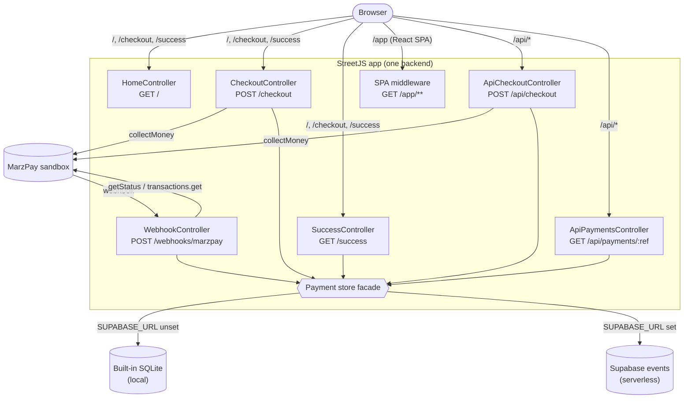

# Architecture

This document describes how the StreetJS + MarzPay demo is put together: its
layers, the request lifecycle, the two persistence backends, and how the same
codebase runs both as a long-running local server and as a Vercel serverless
function.

## Overview

A single StreetJS app exposes three surfaces:

- **Server-rendered pages** (`/`, `/checkout`, `/success`) — the canonical spec
  demo, fixed at 5,000 UGX.
- **A React SPA** mounted at `/app`, served as static files by a small
  middleware and talking to the JSON API.
- **A JSON API** (`/api/checkout`, `/api/payments/:reference`) consumed by the
  SPA; supports a selectable amount and local/international phone numbers.

The MarzPay client (injected by the plugin at `ctx.state.marzpay`) is the
integration boundary for all payment operations. Persistence is abstracted
behind a facade that selects SQLite or Supabase at runtime.



Text view of the same topology:

```
Browser ──▶ StreetJS app
   │           ├─ HomeController        GET  /
   │           ├─ CheckoutController    POST /checkout         (HTML + 303 redirect)
   │           ├─ SuccessController     GET  /success
   │           ├─ WebhookController     POST /webhooks/marzpay
   │           ├─ ApiCheckoutController POST /api/checkout      (JSON)
   │           ├─ ApiPaymentsController GET  /api/payments/:ref (JSON)
   │           └─ SPA middleware        GET  /app/**            (static React build)
   │
   ├─ ctx.state.marzpay  ──▶ MarzPay sandbox (HTTPS)
   └─ Payment store facade ──▶ SQLite (local)  |  Supabase (serverless)
```

## Layers

- **Bootstrap / assembly** (`src/server.ts`)
  - `validateConfig(process.env)` (pure) runs first; invalid config aborts
    startup before any port bind or plugin install.
  - `bootstrap()` creates the app, installs `MarzPayPlugin`, registers the four
    core controllers, and initializes the store. It exposes dependency-injection
    seams (env, app factory, plugin factory, controllers, initSchema, loggers,
    exit) so it is unit-testable.
  - `assembleApp()` wraps `bootstrap()` with the JSON API controllers, the
    Supabase plugin (when configured), and the SPA static middleware. It is the
    shared entrypoint for both the local server and the serverless handler.
- **Configuration** (`src/config.ts`) — a pure `validateConfig` returning either
  a resolved `AppConfig` or the list of offending variables.
- **Controllers** (`src/controllers/*.ts`) — StreetJS decorator controllers.
- **Helpers** (`src/services/marzpay-helpers.ts`) — pure logic: reference
  generation, phone validation/normalization, amount validation, status
  interpretation, webhook parsing. No network, no framework.
- **Persistence** (`src/db/`) — `payments.ts` (SQLite), `supabase-store.ts`
  (append-only Supabase), and `store.ts` (the facade that picks one).
- **Views / static** (`src/views/*.html`, `src/web-static.ts`, `web/`) — the
  server-rendered templates and the React SPA.

## Request lifecycle (happy path)

1. `POST /api/checkout` with `{ phone_number, amount }`.
2. The controller normalizes the phone (local → E.164), validates the amount
   (500–1,000,000 UGX), generates a unique reference, and calls
   `marzpay.collections.collectMoney({ amount, country: 'UG', reference, phone_number })`.
3. On success it persists a `pending` record and returns it as JSON.
4. The customer approves the prompt on their phone.
5. MarzPay POSTs `/webhooks/marzpay`. The handler validates (best-effort), then
   authoritatively calls `getStatus(reference)`; on a completed status it reads
   `transactions.get(reference)` and records completion.
6. The SPA polls `GET /api/payments/:reference` until the status is completed.

## Persistence

The facade `src/db/store.ts` chooses the backend **at call time** (so it
reflects the environment after `.env` is loaded):

- **SQLite** (`payments.ts`) — StreetJS's built-in WASM SQLite. A single
  `payments` row per reference; `insertPending` is idempotent via
  `ON CONFLICT(reference) DO NOTHING`, and `markCompleted` is a conditional
  `UPDATE`. Used locally and in tests.
- **Supabase** (`supabase-store.ts`) — used when `SUPABASE_URL` + a key are set.
  Because `@streetjs/plugin-supabase` exposes only `select` and `insert` (no
  `update`), payments are stored **append-only** in a `payment_events` table:
  each state change is a new row, and the current payment is derived by reducing
  a reference's events (earliest supplies the creation time; the latest supplies
  the effective amount/currency/status). Completion is idempotent — a duplicate
  completed event is skipped.

Both backends implement the same surface (`initSchema`, `insertPending`,
`markCompleted`, `findByReference`), so controllers never know which is active.

See [configuration.md](configuration.md) for the switch and `supabase/schema.sql`
for the table.

## Deployment topology

- **Local / long-running server:** `node dist/server.js` runs `main()`, which
  assembles the app and calls `app.listen()` on `PORT`.
- **Vercel (serverless):** Vercel's `node` framework uses `src/server.ts` as the
  entrypoint and imports its **default export** — a request handler that lazily
  assembles the app once per cold start and routes each request through
  `app._handleRequest(req, res)`. There is no `listen()` in this mode. Startup
  failures are converted to a readable 500 instead of crashing the function.
- The React SPA is built (`web/dist`) during `vercel-build` and served under
  `/app` by `src/web-static.ts`; the build dir is resolved from `process.cwd()`
  so it works in the serverless bundle.

## Correctness & testing

Pure helpers and the SQLite store are covered by unit and property-based tests
(`fast-check`, ≥100 runs), stubbing only the MarzPay client boundary and using
in-memory SQLite. Live-sandbox integration tests exercise the real MarzPay
sandbox and skip when credentials are absent. See the `test/` directory.
